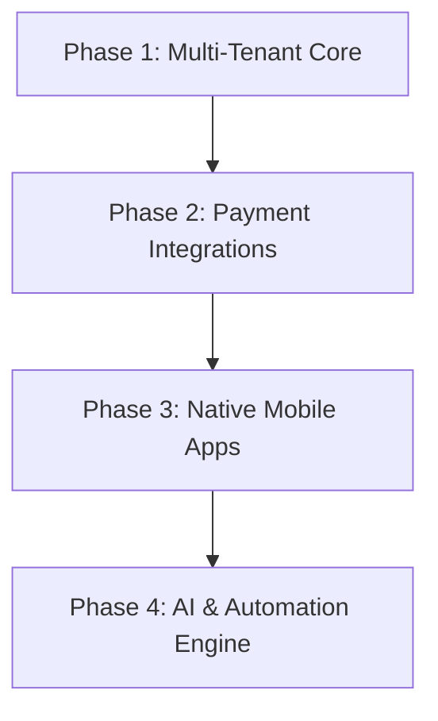

# Product Roadmap - EduFlow ERP Commercial SaaS

This document traces the strategic future features and enhancements planned for the commercial lifecycle of EduFlow ERP.

---

## 🗺️ Future Phases Overview

### Phase 2: Live Payment Webhooks & Communication Gateways (Target: Q3 2026)
- **Stripe & Razorpay Webhooks:** Build automated database state updates when parent tuition fees are cleared online.
- **SMS & Email Channels:** Integrate Twilio and Sendgrid templates for sending real-time automated reports, payment dues, and critical notices directly to parents' phones.
- **Biometric Logs API:** Synchronize offline school gates RFID card reader logs with our attendance collection APIs.

### Phase 3: Mobile & Classroom Extensions (Target: Q4 2026)
- **Native Applications:** Deliver lightweight iOS and Android wrapper packages utilizing React Native or Capacitor for smooth push notifications.
- **LMS Integration:** Connect class timetables and homework pages with Zoom/Google Meet APIs to run online live lectures directly inside portals.

### Phase 4: AI & Automation Engine (Target: Q1 2027)
- **Predictive Student Analytics:** Leverage simple regressions on historical `Result` records to trigger student-at-risk warning banners for teachers.
- **Automated Class Timetables:** An AI scheduler to automatically generate conflict-free teacher lecture timetables based on subject allocations and availability constraints.
- **AI Report Card Comments:** Semi-automated, structured report card remark generation based on attendance records and test percentages.
