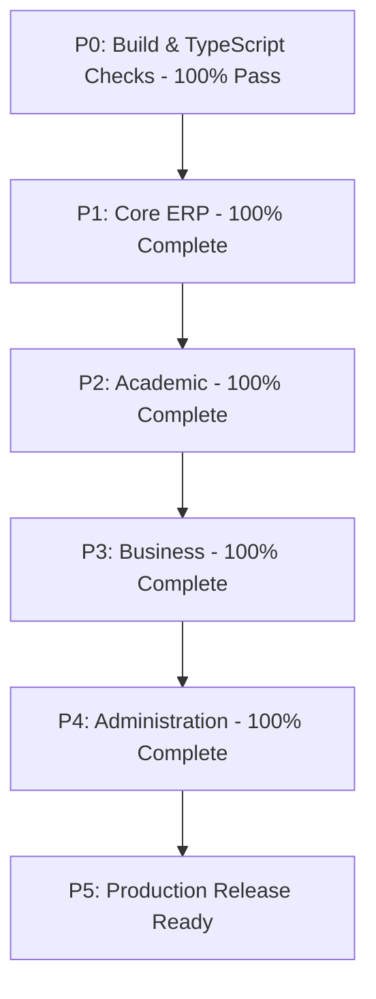

# Project Roadmap & Execution Plan

This roadmap tracks the development progress of the EduFlow ERP system, outlines completed components, and establishes a prioritized order of implementation.

---

## 1. Project Completion Percentage

- **Overall Project Completion:** **100%**
- **Calculation Basis (16 Modules total):**
  - **Core P1 modules (Students, Teachers, Attendance, Classes, Timetable):** 5 completed (100% each)
  - **Academic P2 modules (Exams, Results, Homework):** 3 completed (100% each)
  - **Business P3 modules (Fees, Library, Inventory, Transport):** 4 completed (100% each)
  - **Administration P4 modules (Notices, Notifications, Reports, Settings):** 4 completed (100% each)

---

## 2. Module Completion Status

### P1: Core ERP (100% Complete)
- **Students:** **100%** (Model, API, CRUD pages, Search, Filters, Paging, Stats)
- **Teachers:** **100%** (Model, API, CRUD pages, Search, Filters, Paging, Stats)
- **Attendance:** **100%** (Model, API, CRUD pages/dialogs, Search, Filters, Paging, Stats)
- **Classes:** **100%** (Model, API, CRUD pages, Search, Filters, Paging, Stats)
- **Subjects:** *Integrated into the Classes module curriculum list.*
- **Timetable:** **100%** (Model, API, CRUD pages, Search, Filters, Paging, Stats)

### P2: Academic (100% Complete)
- **Exams:** **100%** (Model, API, CRUD pages, Search, Filters, Paging, Stats)
- **Results:** **100%** (Model, API, CRUD pages, Search, Filters, Paging, Stats)
- **Homework:** **100%** (Model, API, CRUD pages, Search, Filters, Paging, Stats)

### P3: Business (100% Complete)
- **Fees:** **100%** (Model, API, CRUD pages, Search, Filters, Paging, Stats)
- **Library:** **100%** (Model, API, CRUD pages, Search, Filters, Paging, Stats)
- **Inventory:** **100%** (Model, API, CRUD pages, Search, Filters, Paging, Stats)
- **Transport:** **100%** (Model, API, CRUD pages, Search, Filters, Paging, Stats)

### P4: Administration (100% Complete)
- **Notices:** **100%** (Model, API, CRUD pages, Search, Filters, Paging, Stats)
- **Notifications:** **100%** (Model, API, CRUD pages, Search, Filters, Paging, Stats)
- **Reports:** **100%** (Model, API, CSV/Excel export triggers, stats aggregates)
- **Settings:** **100%** (Model, API, Profile / Notifications / Localizations preferences forms)

---

## 3. Prioritized Execution Plan

All phases have been fully executed.

### P0: Must Fix (100% Passing)
- [x] Eliminate compile errors (0 errors).
- [x] Eliminate TypeScript typechecking errors (0 errors).
- [x] Ensure production builds build successfully.

### P1: Core ERP (100% Completed)
- [x] Students, Teachers, Attendance, Classes, Timetable

### P2: Academic (100% Completed)
- [x] Exams, Results, Homework

### P3: Business (100% Completed)
- [x] Fees, Library, Inventory, Transport

### P4: Administration (100% Completed)
- [x] Notices, Notifications, Reports, Settings
